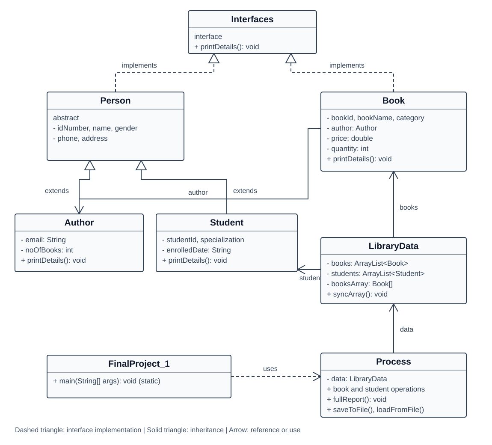

# Library Management System

A console library project I built while learning OOP in Java. I used inheritance, an abstract class, interfaces, ArrayList, arrays and object serialization.

## Features

- Add, list, search and delete books.
- Search by book ID or part of the title.
- Buy a copy by ID and reduce the available quantity.
- Add and list students, and display a combined report.
- Save the library on exit and load it on the next run.

Book IDs and university IDs cannot be duplicated. Text fields cannot be blank, and prices and quantities must be finite and nonnegative.

## Run locally

Install a JDK. The project uses only the Java standard library. Run `FinalProject_1` in a Java IDE, or use PowerShell from the project folder:

```powershell
javac -d out (Get-ChildItem src/finalproject_1/*.java).FullName
java -cp out finalproject_1.FinalProject_1
```

Choose option `9` to save and exit. Closing the terminal directly does not save new changes. Data is written to `library.dat` in the working directory and loaded on startup. The program stops if that file cannot be read.

## Classes

| Class | Responsibility |
| --- | --- |
| Interfaces | Declares printDetails(). |
| Person | Abstract class for shared person details. |
| Student | Student details; inherits from Person. |
| Author | Author details; inherits from Person. |
| Book | Book details and an author reference. |
| LibraryData | Book and student collections, and the book array. |
| Process | Library operations, input checks and file storage. |
| FinalProject_1 | Main method and console menu. |

## UML

The diagram shows the main fields, methods and relationships. Routine getters and setters are omitted for readability.



The data classes use `Serializable`, `ObjectOutputStream` and `ObjectInputStream` for local storage.

## Project scope

This is an OOP learning project. Some student and author details use placeholder values such as `N/A`. It has no borrowing system, purchase history, payment integration or graphical interface.

## Author

Adham Hashem
